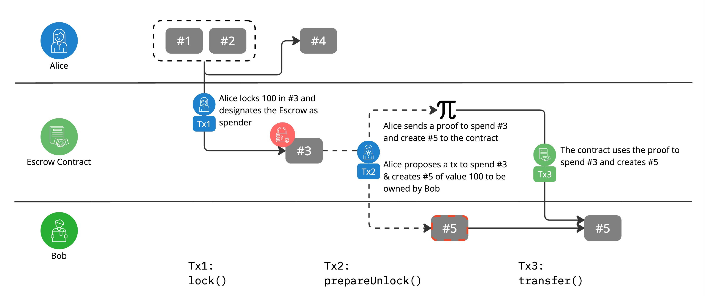

# Locking UTXOs

In a typical atomic swap flow, based on the popular ERC20 token standard, the tokens from the trading parties are transferred to an escrow contract, which then coordinates the settlements with all the trading parties to ensure safety for all the involved parties.

This type of swap design is not possible with Zeto tokens, unfortunately. An escrow contract can not own tokens because Solidity contract doesn't have the ability to generate ZK proofs required to spend Zeto tokens.

This is where the `locking` mechanism comes in.

As illustrated above, regular (unlocked) UTXOs can be spent by any Ethereum account submitting a valid proof. This is an important privacy feature because it doesn't require the Ethereum transaction signing account to be tied to the ownership of the Zeto tokens. As a result, the Zeto tokens owner can use a different Ethereum signing key for each transaction, to avoid their transaction history to be analyzed based on the base ledger transactions.

On the other hand, a UTXO can be locked with a designated `spender`, which is an Ethereum account address. The owner of the token is still required to produce a valid proof, which then must be submitted by the designated `spender` key, signing the transaction to spend the locked UTXO(s).

In the locking transaction above, a locked UTXO, \#3 was created. The owner is still Alice, but the spender has been set to the address of an escrow contract. This means Alice as the owner can no longer spend UTXO \#3, even though she can produce a valid spending proof. In order to spend a locked UTXO, a valid proof must be submitted by the designated spender.

## Lock, then delegate

The following diagram illustrates a typical flow to use the locking mechanism.

- Alice and Bob are in a bilateral trade where Alice sends Bob 100 Zeto tokens for payment, at the same time Bob sends Alice some asset tokens which are omitted from the diagram
- In transaction 1, `Tx1`, Alice calls `lock()` to lock 100 into a new UTXO \#3, by spending two existing UTOXs \#1 and \#2. The transaction also creates \#4 for the remainder value, which is unlocked. This transaction designates the escrow contract as the spender for the locked UTXO \#3
- Alice then sends another transaction, `Tx2`, to call `prepareUnlock()` on the escrow contract and sends a valid proof to the contract. This proof can be used to spend the locked \#3 UTXO and create \#5, which will be owned by Bob
  > the contract will verify that the proof is valid for the intended UTXO spending
- Alice and Bob continues with the trade using the escrow contract logic. The details of the remainder of the trade flow are omitted
- When the trade setup is complete, and ready to settle atomically, a party can call the escrow contract to carry out the execution phase. The escrow contract calls Zeto to `transfer()` the locked UTXO \#3 and creates \#5, as was originally intended in the trade setup phase
