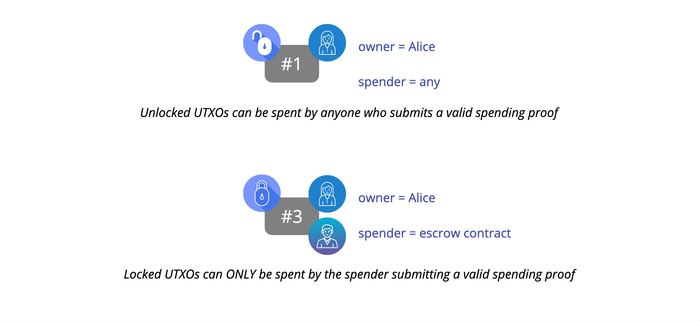
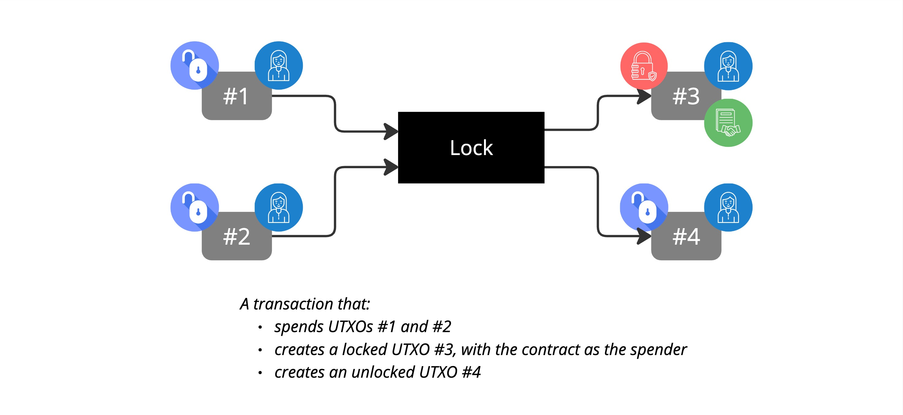
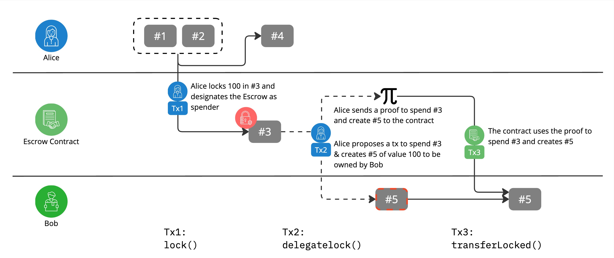

# Locking UTXOs

In a typical atomic swap flow, based on the popular ERC20 token standard, the tokens from the trading parties are transferred to an escrow contract, which then coordinates the settlements with all the trading parties to ensure safety for all the involved parties.

This type of swap design is not possible with Zeto tokens, unfortunately. An escrow contract can not own tokens because Solidity contract doesn't have the ability to generate ZK proofs required to spend Zeto tokens.

This is where the `locking` mechanism comes in.

As illustrated above, regular (unlocked) UTXOs can be spent by any Ethereum account submitting a valid proof. This is an important privacy feature because it doesn't require the Ethereum transaction signing account to be tied to the ownership of the Zeto tokens. As a result, the Zeto tokens owner can use a different Ethereum signing key for each transaction, to avoid their transaction history to be analyzed based on the base ledger transactions.

On the other hand, a UTXO can be locked with a designated `spender`, which is an Ethereum account address. The owner of the token is still required to produce a valid proof, which then must be submitted by the designated `spender` key, signing the transaction to spend the locked UTXO(s).

In the locking transaction above, a locked UTXO, \#3 was created. The owner is still Alice, but the spender has been set to the address of an escrow contract. This means Alice as the owner can no longer spend UTXO \#3, even though she can produce a valid spending proof. In order to spend a locked UTXO, a valid proof must be submitted by the designated spender.

## The lockable capability model

In releases after v0.3.2, Zeto tokens implement the generic `ILockableCapability` interface, shared with the [Paladin project](https://lf-decentralized-trust-labs.github.io/paladin/head/concepts/tokens/). This provides a standardized lifecycle for locking resources that can be delegated to another party (such as an escrow contract) before being consumed or cancelled.

Each lock is identified by a unique `lockId`. When created, the caller is both the **owner** (who originally created the lock) and the **spender** (who is authorized to spend, cancel, or delegate the lock). The owner can optionally bind the lock to specific spend or cancel operations using **commitment hashes** before delegating authority to a third party.

Zeto tokens extend this interface with `IZetoLockableCapability`, which defines the ABI-encoded argument payloads (`ZetoCreateLockArgs`, `ZetoSpendLockArgs`, etc.) and Zeto-specific events. The shared lock lifecycle logic lives in the external `ZetoLockableLib` library, linked by all lockable token implementations.

### Lock lifecycle

| Operation | Description |
| --------- | ----------- |
| `createLock` | Consume input UTXOs and produce locked output UTXOs under a new lock. The caller becomes both owner and spender. |
| `updateLock` | While the lock is owner-controlled (`spender == owner`), rewrite the spend/cancel commitment hashes. |
| `delegateLock` | Transfer spending authority to a new address (e.g. an escrow contract). After delegation, only the new spender can spend, cancel, or re-delegate. |
| `spendLock` | Consume the lock's pinned UTXOs and produce unlocked outputs, executing the intended payment. |
| `cancelLock` | Cancel the lock and return value according to a cancel proof (e.g. refund to the owner). |

The locked input UTXOs are **pinned in storage** at `createLock` time. When spending or cancelling, the contract reads them from storage via `getLockedInputs(lockId)` rather than trusting caller-supplied arrays. This ensures that spending lock A always consumes lock A's UTXOs.

Optional commitment hashes (`spendCommitment`, `cancelCommitment`) let the lock creator restrict what payload can successfully call `spendLock` or `cancelLock`. Use `computeSpendHash()` and `computeCancelHash()` to pre-compute these values. A zero commitment means unrestricted.

The lock ID is deterministically computed as `keccak256(abi.encode(tokenAddress, msg.sender, txId))` and can be predicted via `computeLockId()` before submitting `createLock`.

## Lock, then delegate

The following diagram illustrates a typical flow to use the locking mechanism.

- Alice and Bob are in a bilateral trade where Alice sends Bob 100 Zeto tokens for payment, at the same time Bob sends Alice some asset tokens which are omitted from the diagram
- In transaction 1, `Tx1`, Alice calls `createLock()` to lock 100 into a new UTXO \#3, by spending two existing UTXOs \#1 and \#2. The transaction also creates \#4 for the remainder value, which is unlocked. Alice is initially both the owner and spender of the new lock
- In transaction 2, `Tx2`, Alice calls `delegateLock()` on the Zeto token, naming the escrow contract as the new spender. From this point on, only the escrow can spend or cancel the lock
- Alice (or anyone) calls `initiatePayment()` on the escrow contract with the `lockId` and the proposed unlocked output UTXOs (e.g. \#5 for Bob). The escrow verifies it is the current spender before recording the payment
- An authorised approver calls `approvePayment()` on the escrow contract with a valid ZK proof attesting that the locked inputs can be spent to produce the proposed outputs. The escrow verifies the proof but does not yet consume the lock
- When the trade setup is complete and ready to settle atomically, a party calls `completePayment()` on the escrow contract. The escrow forwards the stored proof to `spendLock()` on the Zeto token, which consumes the locked UTXO \#3 and creates \#5 for Bob in a single atomic step

If the trade is cancelled instead, the escrow (or the current spender) can call `cancelLock()` with a valid cancel proof to return the locked value to Alice.

### Sample escrow contracts

Reference implementations of the above pattern are available in the Solidity test contracts:

- [zkEscrow1](https://github.com/LFDT-Paladin/zeto/blob/main/solidity/contracts/test/escrow1.sol) — escrow over `Zeto_Anon`
- [zkEscrow2](https://github.com/LFDT-Paladin/zeto/blob/main/solidity/contracts/test/escrow2.sol) — escrow over `Zeto_AnonNullifier`

Integration tests for the lock lifecycle are included in the token test suites under `solidity/test/`.
