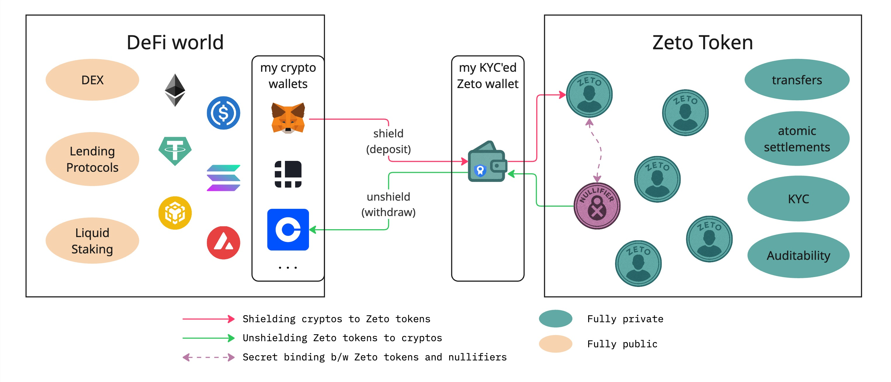

# Zeto as Cryptos Mixer

As illustrated above, DeFi users can leverage the Zeto token contract as a privacy-preserving mixer by shielding (depositing) their cryptocurrency tokens into the Zeto contract in exchange for Zeto tokens of equivalent value. These Zeto tokens can later be unshielded (withdrawn) into cryptocurrency tokens using a different wallet. This process effectively allows a user to move funds from one wallet to another, without leaving a traceable link between the deposit and withdrawal.

This untraceability is achieved through the use of nullifiers during the withdrawal process, which obscure the specific Zeto tokens (UTXOs) being spent. Because external observers cannot correlate the nullifiers used in withdrawals with the tokens created during deposits, it becomes infeasible to link the cryptocurrency that entered the mixer with what comes out.

This enables DeFi users to maintain strong privacy while engaging in DeFi activities.

## Sample Implementation

A sample implementation of the above flow is available in the integration test at [usdc-shielding.ts](https://github.com/hyperledger-labs/zeto/blob/main/solidity/test/usdc-shielding.ts).

## Regulatory Compliance

Regulatory compliance can be readily achieved by enforcing KYC at the Zeto token level, as demonstrated in the implementation [Zeto_AnonNullifierKyc](../implementations/anon_nullifier_kyc.md). Before depositing tokens into Zeto, a DeFi user must first complete KYC verification for their Zeto wallet. This ensures that all users utilizing the mixer functionality comply with regulatory requirements.
