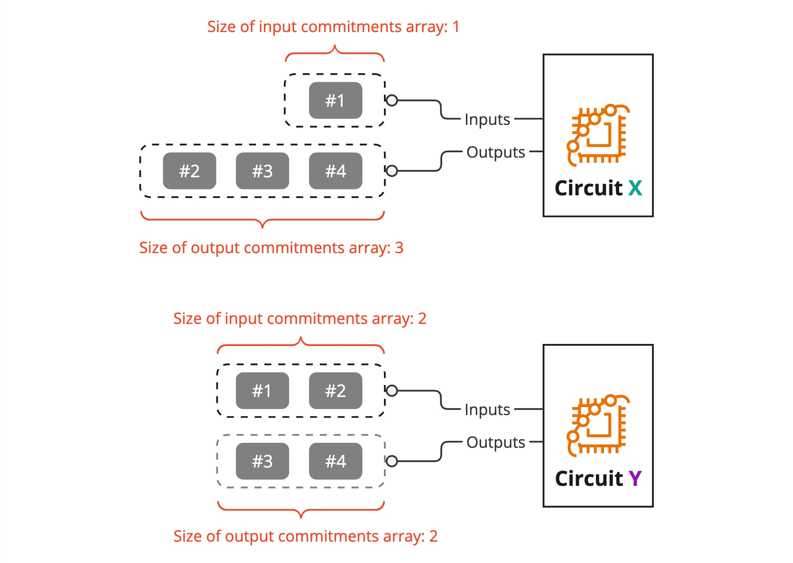

# Supporting different UTXO array sizes

Using ZK proofs presents a special challenge for supporting UTXO inputs and outputs that are of different sizes. For instance, a transaction proposal that consumes 1 UTXO, owned by Alice, but generates 3 UTXOs to be owned by Bob, Charlie and Alice, will require a different circuit for the proof than a transaction that consumes 2 UTXOs and generates 2 UTXOs.


_Using different array sizes for the input signals require different verification circuits_

This is because a ZKP circuit must always perform the exact same computation. Therefore, if there are arrays in the input signals, the size of the arrays must be known at compile time.


_Using the same array sizes for the input signals require the same verification circuit_

For all Zeto token implementations, two sizes are chosen for the circuits: `2` and `10`.

## Size = 2

For example, the following top-level circuit is for the token implementation `Zeto_Anon`,

```
[file: zkp/circuits/anon.circom]
include "./basetokens/anon_base.circom";

component main { public [ inputCommitments, outputCommitments ] } = Zeto(2, 2);
```

The `Zeto(2, 2)` part provides fixed values for the parameterized circuit template from `basetokens/anon_base.circom`, which looks like this,

```
template Zeto(nInputs, nOutputs) {
  signal input inputCommitments[nInputs];
  signal input inputValues[nInputs];
  signal input inputSalts[nInputs];
  signal input outputCommitments[nOutputs];
  signal input outputValues[nOutputs];
  signal input outputSalts[nOutputs];
  signal input outputOwnerPublicKeys[nOutputs][2];

  ...
}
```

The parameterized template support different array sizes for both the inputs and outputs, but for the final circuit to be compiled, we set the size to `2` for both the inputs and outputs. This corresponds to the Solidity function in the token implementation:

```javascript
function transfer(
  uint256[] memory inputs,
  uint256[] memory outputs,
  Commonlib.Proof calldata proof,
  bytes calldata data
) public returns (bool) { ... }
```

When a transaction calls this function with inputs and outputs sizes of 1 or 2, the Solidity code will pad the arrays to size 2, and use the verifier library generated from the above circuit (`Zeto(2, 2)`) to verify the proof.

## Size = 10

To support array size of 10 in the input signals, we simply set the size parameters to `10` in the top-level circuit:

```
[file: zkp/circuits/anon_batch.circom]
include "./basetokens/anon_base.circom";

component main { public [ inputCommitments, outputCommitments ] } = Zeto(10, 10);
```
