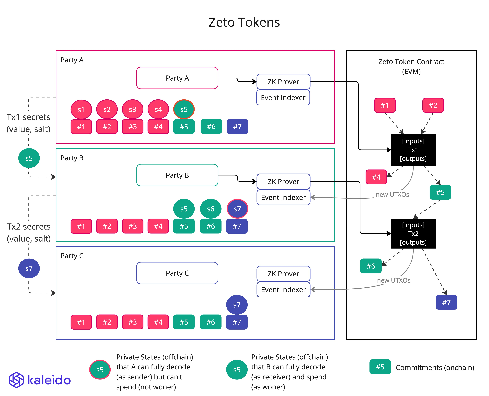

# How Zeto tokens work

- Party A owns 3 Zeto tokens at the beginning: `#1, #2, #3`. The 3 tokens have been minted in the Zeto smart contract and represented by their commitments, aka `hash(value, owner public key, salt)`
  - As the owner of the tokens, party A also has access to the secrets that the commitments can be opened to, namely the value and salt. The secrets are represented as private states: `s1, s2, s3`
  - How party A obtained the secrets for the owned tokens, is dependent on the specific Zeto implementation. It can be from offchain channels or from onchain (encrypted) data
- Party A sends transaction `Tx1` to transfer some value to party B. The transaction consumes 2 tokens `#1, #2` and produces 2 new tokens `#4, #5`. `#5` is the value to be transferred to party B. `#4` is the remainder value that goes back to party A
  - Even though party A knows the secrets of `#5`, they won't be able to spend the token because party A is not the owner of the token.
  - Ownership verification is enforced by the Zeto smart contract when it verifies the zero knowledge proofs. Each ZKP circuit ensures that the sender's private key is used as a private input signal to derive the public key, which is then hashed to calculate the commitments
- Party B sends transaction `Tx2` to transfer some value to party C. This works the same as `Tx1`
- All parties get the commitments, `#1, #2, ... #7`, from the onchain events

The above diagram illustrates that the secrets are transmitted from the sender to the receiver in an off-chain secure channel. Other means of sharing the secrets are avaiable in Zeto token implementations. For instance, the [Zeto_AnonEnc](https://github.com/hyperledger-labs/zeto/blob/main/solidity/contracts/zeto_anon_enc.sol) implementation includes encrypted secrets in the transaction input, and emits an event with the encrypted values. The encrypted values can only be decrypted by the receiver.

## EC Cryptography

Performing key pair operations, such as deriving the public key from the private key, in the ZKP circuit requires ZKP-friendly curves, for which we picked [Babyjubjub](https://docs.iden3.io/publications/pdfs/Baby-Jubjub.pdf) instead of the regular Ethereum curve (secp256k1).

## Transaction Signing

Another implication to the usage of ZKPs as transaction validity proof and the usage of the Babyjubjub curve, is that the signer of the transaction, eg. `msg.sender`, no longer bears the same significance as in other token implementations such as ERC20, ERC721, where the signer's EVM account address holds the actual assets. In Zeto tokens, it's the Babyjubjub public keys that hold the entitlement to spend the tokens. In fact, the applications are encouraged to use a different signing key for each transaction, to avoid leaking transaction behaviors and breaking anonymity.
