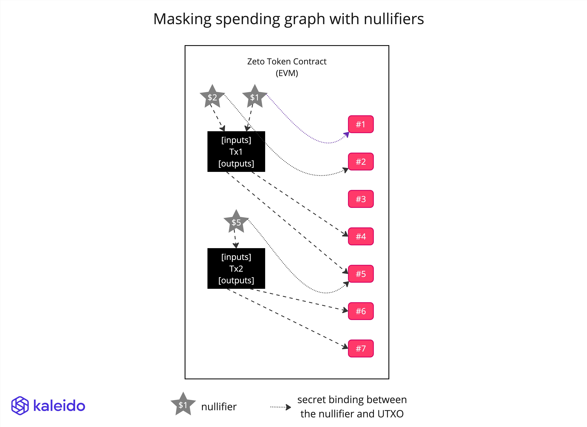

# Zeto_AnonNullifier

| Anonymity          | History Masking    | Encryption | KYC | Non-repudiation | Gas Cost (estimate) |
| ------------------ | ------------------ | ---------- | --- | --------------- | ------------------- |
| :heavy_check_mark: | :heavy_check_mark: | -          | -   | -               | 2,005,587           |

To mask the association between the consumed UTXOs and the output UTXOs, we hide which UTXOs are being consumed by each transaction.

To achieve this, we employ the usage of nullifiers. It's a unique hash derived from the unique commitment it consumes. For a UTXO commitment hash(value, salt, owner public key), the nullifier is calculated as hash(value, salt, owner private key). Only the owner of the commitment can generate the nullifier hash. Each transaction will record the nullifiers in the smart contract, to ensure that they don't get re-used (double spending).

In order to prove that the UTXOs to be spent actually exist, we use a merkle tree proof inside the zero knowledge proof circuit. The merkle proof is validated against a merkle tree root that is maintained by the smart contract. The smart contract keeps track of all the new UTXOs in each transaction's output commitments array, and uses a merkle tree to calculate the root hash. Then the ZKP circuit can use a root hash as public input, to prove that the input commitments (UTXOs to be spent), which are private inputs to the circuit, are included in the merkle tree represented by the root.

The end result is that, from the onchain data, no one can figure out which UTXOs have been spent, while double spending is prevented.

The statements in the proof include:

- each value in the output commitments must be a positive number in the range 0 ~ (2\*\*40 - 1)
- the sum of the nullified values match the sum of output values
- the hashes in the output match the hash(value, salt, owner public key) formula
- the sender possesses the private BabyJubjub key, whose public key is part of the pre-image of the input commitment hashes, which match the corresponding nullifiers
- the nullifiers represent input commitments that are included in a Sparse Merkle Tree represented by the root hash

