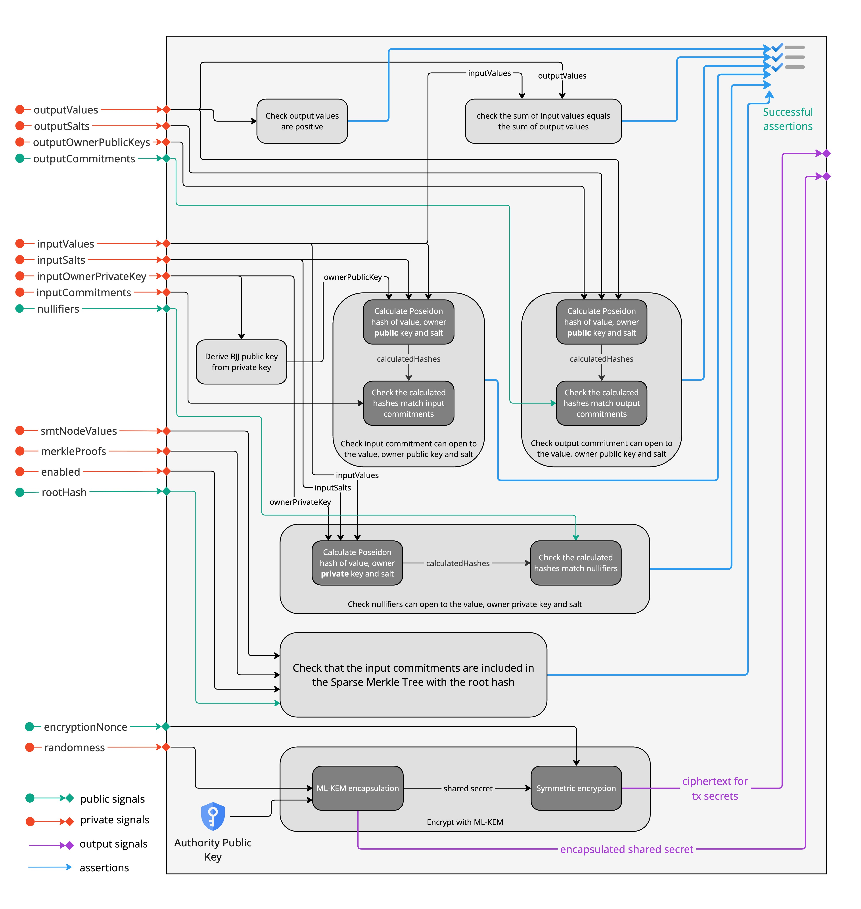

# Zeto_AnonNullifierQurrency

| Anonymity          | History Masking    | Encryption         | KYC | Non-repudiation | Gas Cost (estimate) |
| ------------------ | ------------------ | ------------------ | --- | --------------- | ------------------- |
| :heavy_check_mark: | :heavy_check_mark: | :heavy_check_mark: | -   | -               | 2,066,430           |


This implementation builds on top of the `anon_nullifiers` to add post-quantum cryptography inside the circuit to encrypt sensitive information for a designated authority, such as a regulator, for auditing purposes.

To implement post-quantum secure encryption, these circuits use the public key encryption scheme in ML-KEM (Module-Lattice-Based Key-Encapsulation Mechanism), which is derived from the CRYSTALS-KYBER algorithm. This algorithm has been selected by NIST for standardization of post-quantum secure encryption, meaning even quantum computers cannot break the cryptosystem.

The encryption is performed in the follow step, according to the ML-KEM scheme:

- A 256-bit randomness is generated, and used as a private input to the ZKP circuit, which carries out the ML-KEM key encapsulation protocol along with the public key of the auditing authority
  - The public key is statically programmed into the circuit. This is to avoid making it a signal which would be very inefficient due to the large size of the public key (1184 bytes)
  - <span style="color:red">IMPORTANT:</span> This means for a real world deployment, the deployer MUST update the circuit with the auditing authority's public key and re-compile the circuit
- The result of the ML-KEM protocol is a 256-bit shared secret
  - In addition, an encapsulated shared secret is also generated to be shared with the receiver (the auditing authority) to recover the shared secret
- The secrets targeted for the auditing authority are encrypted with this shared secret, and sent as part of the transaction payload
- The ciphertext for the encrypted secrets, and the encapsulated shared secret for the ML-KEM decapsulation (the process to recover the shared secret) are returned by the circuit as output signals
- The auditing authority can then use their private key, along with the encapsulated shared secret which is included in the emitted blockchain event, to recover the shared secret via the ML-KEM decapsulation protocol
  - The recovered shared secret can then be used to decrypt the ciphertext of the encrypted secrets, giving the auditing authority full information about the secrets involved in the transaction

The statements in the proof include:

- each value in the output commitments must be a positive number in the range 0 ~ (2\*\*100 - 1)
- the sum of the nullified values match the sum of output values
- the hashes in the output match the hash(value, salt, owner public key) formula
- the sender possesses the private BabyJubjub key, whose public key is part of the pre-image of the input commitment hashes, which match the corresponding nullifiers
- the nullifiers represent input commitments that are included in a Sparse Merkle Tree represented by the root hash
- the auditing authority's public key was correctly used in the ML-KEM encapsulation protocol, resulting in the ciphretext for decapsulation
- the shared secret, resulted from the above ML-KEM encapsulation protocol, was correctly used to encrypt the secrets in the transaction outputs

[](../images/circuit_wiring_anon_nullifier_qurrency.jpg)

# Zero-Knowledge Circuit Setup

In order to initialize a zero-knowledge proof circuit corresponding to a particular auditor, we require information about the auditor's ML-KEM public key to be encoded into the circuit.

## Background

[ML-KEM](https://nvlpubs.nist.gov/nistpubs/FIPS/NIST.FIPS.203.pdf) is a key-encapsulation mechanism, which internally initializes and uses a public key encryption scheme referred to as K-PKE. The Qurrency protocol uses this internal PKE scheme to provide post-quantum secure public key encryption. K-PKE was chosen because to date it is the only post-quantum secure PKE scheme to appear in a NIST standardization. It has been selected for standardization as a standalone post-quantum secure PKE scheme, and the standardization process is expected to complete by 2027.

For any implementation, calling $\mathsf{ML\mathrm{-}KEM}.\mathsf{KeyGen}()$ will return an encapsulation key `ek` and a decapsulation key `dk`. Since `ek` is identical to the public key of the internal PKE scheme, we can directly use `ek` to build the ZK circuit. `ek` is an array of 800 bytes, of the following form:

- The first 768 bytes encode an array `t` of 512 integers modulo a prime $q$, where $q = 3329$. Each integer is encoded in 12 bits.
- The remaining 32 bytes is used as a random seed `rho`, which generates a matrix `a`. This is a 2x2 matrix, where each element is an array of 256 integers mod $q$.

Our circuits are designed for ML-KEM-512 in particular, so all parameters are chosen relative to this scheme.

## Circuit Preparation

For this example, we'll demonstrate the circuit generation process using the `mlkem` [npm module](https://www.npmjs.com/package/mlkem), although any secure ML-KEM implementation will suffice. After generating your keys:

```javascript
const mlkem = new MlKem512();
const [ek, dk] = await mlkem.generateKeyPair();
```

Securely store `dk` to use in audits. (In particular, auditing requires the first 768 bytes of `dk`, which corresponds to the private key of the PKE scheme.) Then setup the `kyber.circom` circuit inside `zkp/circuits/lib/kyber` with the following steps.

1. Separate `ek` into `t` (the first 768 bytes) and `rho` (the remaining 32 bytes).
2. For each 384-byte half `ti` of `t`, compute `polyFromBytes(ti)`. This is the `mlkem` implementation of $\mathsf{ByteDecode}_{12}$ from the ML-KEM specification. It decodes the two halves of `t` back into arrays of integers. These two arrays can be inserted as `t[0]` and `t[1]` inside the `kyber_enc` circuit.
3. Compute the matrix `a` as `_sampleMatrix(rho, false)`. In the ML-KEM specification, each entry `a[i,j]` of `a` is computed as $\mathsf{SampleNTT}(\rho \mathbin\Vert j \mathbin\Vert i)$. In `mlkem`, this function computes all four entries of `a` at once. These can then be inserted into the corresponding `a[0][0]`, `a[0][1]`, `a[1][0]`, and `a[1][1]` inside the `kyber_enc` circuit.

After this, circuit generation is complete, and setup can continue the same as all other Zeto tokens.

**Note**: The `_sampleMatrix` function is not exposed by the `mlkem` library for external use, so for circuit initialization, you may have to either re-implement this functionality, or temporarily modify the library to expose this.

### Utility Script

A utility script has been provided in the `zkp/circuits/scripts` folder, which can be launched with the following command:

```console
$ npm run qurrency-keygen
```

It prints out the following parts that are described above:

- `t[0]`
- `t[1]`
- `a[0][0]`
- `a[0][1]`
- `a[1][0]`
- `a[1][1]`
- `PUBLIC KEY`: corresponding to the `ek` described above. This is not used directly because it's expanded format with `t` and `a` arrays will be added to the circuit directly to perform the encapsulation
- `SECRET KEY`: corresponding to the `dk` described above. This should be used to decapsulate to recover the AES key from the cipher text.
- `PUBLIC KEY HASH`: corresponding to the `signal sha3_256_digest[256]` in the template `g()` of the circuit `zkp/circuits/lib/kyber/mlkem.circom`
