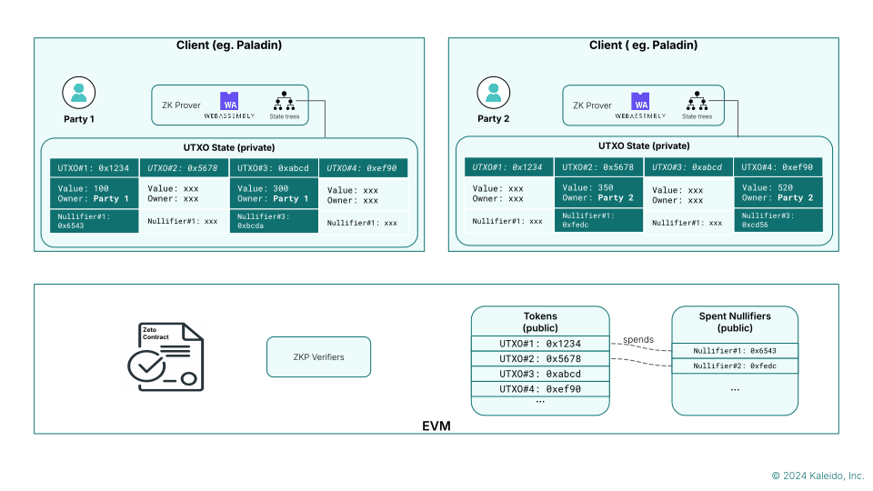

# Zeto

Zeto is a collection of privacy-preserving token implementations on EVM, using Zero Knowledge Proof to enforce a varieties of tokenonmic policies, suited for use in enterprise use cases such as CBDCs, tokenized deposits, security trading that meet regulatory requirements such as KYC.

Zeto tokens give enterprises control of sensitive information without compromising transparency or scalability.

The Zeto project is Apache 2.0 open source, with open governance through [Linux Foundation Decentralized Trust](https://www.lfdecentralizedtrust.org).

## Programmable privacy for EVM

The Ethereum Virtual Machine (EVM) powers over 80% of global blockchain projects, making it the 'de facto'
runtime environment for both enterprise and permissionless networks.

However, there are requirements for enterprise use cases that are not met by the core standard
of EVM. The Zeto project is part of a larger effort, [the Paladin project](https://lf-decentralized-trust-labs.github.io/paladin/head/), which brings latest generation of innovation in solving these requirements in the
EVM ecosystem, and provides a comprehensive enterprise grade Apache 2.0 open source stack to deliver them.

- Anonymity for all parties involved in transactions
- Confidential transaction details
- Transaction history masking to prevent tracking
- Selective data sharing
- Confidential business logic
- Privacy preserving smart contracts
- Private token and asset management
- Atomic transactions across privacy domains
